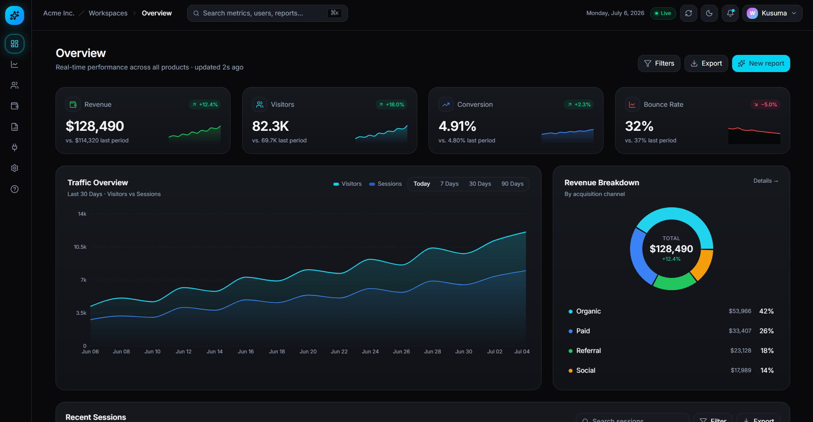

# Pulse — Real-Time SaaS Analytics Dashboard

Pulse is an enterprise-grade, real-time SaaS analytics dashboard designed to monitor and manage key performance indicators in one sleek interface. Built with high-performance modern web technologies, it features rich visualization, smooth UX micro-interactions, responsive design, and robust client-side state handling.



## 🚀 Features

- **Real-Time Revenue Analytics**: Track Daily/Monthly Recurring Revenue (MRR), Annual Run Rate (ARR), and Average Revenue Per User (ARPU).
- **Visitor & Session Intelligence**: Visualize live user traffic, geographic demographics, session duration, and device configurations.
- **Conversion Funnels & Goals**: Monitor custom user conversion goals and funnel drop-off rates.
- **Modern UI Components**: Fully accessible dashboard layout including sidebar, dark mode support, custom filters, search, and dynamic notifications.
- **Interactive Data Visualizations**: Beautiful, responsive charts powered by Recharts (Area, Bar, Line, and Pie charts).

---

## 🛠️ Tech Stack

- **Framework**: [TanStack Start](https://tanstack.com/router/latest/docs/start/overview) (powered by TanStack Router and Vite)
- **UI Libraries**: React 19, Radix UI Primitives, Lucide Icons, Recharts, Embla Carousel
- **Styling**: Tailwind CSS v4 (incorporating modern HSL-tailored custom color palettes)
- **Data Fetching & State**: TanStack Query (React Query)
- **Language**: TypeScript
- **Tooling & Quality**: ESLint, Prettier, Vite

---

## 📂 Project Structure

```text
├── public/                 # Static assets (favicons, etc.)
├── src/
│   ├── components/         # Reusable UI component library (Accordion, Tabs, Dialogs, etc.)
│   ├── hooks/              # Custom React hooks (theme, query, data filters)
│   ├── lib/                # Library utilities (App error reporting, api clients, helpers)
│   ├── routes/             # TanStack Router page structure
│   │   ├── __root.tsx      # Main application layout, HTML shell, and global configurations
│   │   └── index.tsx       # Primary dashboard screen & analytics visualization
│   ├── server.ts           # TanStack Start server entry point
│   ├── start.ts            # Client-side router bootstrap entry point
│   └── styles.css          # Tailwind CSS directives & global custom variable styling
├── package.json            # Scripts and dependencies
└── tsconfig.json           # TypeScript configuration
```

---

## ⚙️ Installation & Development

Follow these steps to run the project locally.

### Prerequisites
Make sure you have [Node.js](https://nodejs.org/) installed (v18+ recommended).

### 1. Install Dependencies
```bash
npm install
```

### 2. Run the Development Server
```bash
npm run dev
```
The application will launch locally (typically at `http://localhost:3000`).

### 3. Build for Production
To generate a production-ready build:
```bash
npm run build
```

### 4. Code Quality & Formatting
Run ESLint to check for code quality issues:
```bash
npm run lint
```

Format the codebase using Prettier:
```bash
npm run format
```

---

<div align="center">

Made with ❤️ by **Wijaya Kusuma**

</div>
